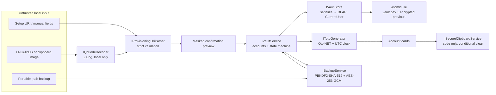

# Architecture

## Goals and constraints

Personal Authenticator is a single-user, Windows-only, local-first desktop application. Its primary constraints are complete offline operation, optional encrypted sync, testable domain logic, strict import validation, no plaintext secret persistence, and clear separation between Windows/WinUI code and portable business rules.

The solution uses constructor injection and one composition root in `PersonalAuthenticator.App/App.xaml.cs`. Business behavior is accessed through Core interfaces; Infrastructure supplies Windows and cryptographic implementations. There is no global service locator used by business code.

## Solution structure

| Project | Responsibility |
| --- | --- |
| `PersonalAuthenticator.App` | WinUI 3 views, dialogs, ViewModels, a shared UI timer, theming, notifications, accessibility bindings, window/session lifecycle handling, and dependency-injection registration |
| `PersonalAuthenticator.Core` | Domain objects, vault state machine, strict provisioning parser, duplicate detection, sensitive-buffer ownership, clocks, and all boundary interfaces; no WinUI dependency |
| `PersonalAuthenticator.Infrastructure` | Otp.NET adapter, encrypted SQLite v2 vault and immutable operation log, DPAPI keys/device identity, transactional outbox, Argon2id/AES-GCM local-folder sync and Recovery-A/B, atomic files, portable backup encryption, local ZXing QR decoding, clipboard behavior, settings persistence, Windows user verification/session events, and structured logging |
| `PersonalAuthenticator.Core.Tests` | Parser, sensitive-buffer, and vault-service tests |
| `PersonalAuthenticator.Infrastructure.Tests` | RFC TOTP, DPAPI, portable-backup, logging-policy, and ViewModel tests |

Dependencies point inward:

```text
PersonalAuthenticator.App ───────► PersonalAuthenticator.Core
          │
          └──────────────────────► PersonalAuthenticator.Infrastructure ───► PersonalAuthenticator.Core

Test projects ───────────────────► the projects under test
```

Core references Otp.NET only for Base32 decoding in the strict provisioning parser. It has no Windows UI or storage dependency.

## Runtime composition

`App.ConfigureServices` registers singleton implementations for the lifetime of the process:

- `IClock` → `SystemClock`
- `IProvisioningUriParser` → `ProvisioningUriParser`
- `ITotpGenerator` → `OtpNetTotpGenerator`
- `IVaultStore` → `DpapiVaultStore`
- `IVaultService` → `VaultService`
- `IBackupService` → `PasswordBackupService`
- `IQrCodeDecoder` → `LocalQrCodeDecoder`
- `ISecureClipboardService` → `SecureClipboardService`
- `IUserVerificationService` → `WindowsUserVerificationService`
- `IAutomaticLockMonitor` → `WindowsSessionLockMonitor`
- `IAppSettingsStore` → `JsonAppSettingsStore`

`MainViewModel` orchestrates these interfaces. `MainWindow` and the dialogs retain view-specific tasks such as pickers, WinUI dialog construction, native window integration, Mica fallback, and event routing.

## Data flow



### Provisioning

1. A URI is entered directly, decoded from a local image, or constructed from manual fields.
2. `ProvisioningUriParser` enforces a 4,096-character limit, the `otpauth` scheme, the `totp` host, a fixed parameter set, unique parameters, valid issuer/label relationships, supported algorithms, six/eight digits, a 15–300 second period, and a 10–128 byte decoded secret.
3. `ParsedTotpProvisioning` owns the temporary secret in a mutable `SensitiveBuffer`.
4. The UI displays account metadata and only a masked two-byte suffix.
5. After confirmation, a `TotpAccount` takes a copy into its own `SensitiveBuffer`; the temporary provisioning object is disposed.
6. `VaultService` checks a session-keyed HMAC-SHA-256 duplicate fingerprint and applies cancel, replace, or add-separate behavior.

### Code generation

`MainWindow` owns one `DispatcherQueueTimer` ticking once per second. `MainViewModel.RefreshCodes` obtains one UTC timestamp and updates visible cards. Each `AccountCardViewModel` updates its countdown every tick but calls Otp.NET only when the account's time-step number changes or a hidden code is revealed. No vault write or decrypt occurs on a timer tick.

The monotonic stopwatch is compared with wall-clock movement. A difference greater than five seconds emits a warning; this is jump detection, not authoritative time synchronization.

### Clipboard

The ViewModel generates only the current numeric OTP and passes it to `ISecureClipboardService`. The Windows data package disables clipboard history and roaming where the platform honors those flags. Each copy adds a fresh 16-byte random ownership value, encoded as hex in the custom clipboard format `application/x-personal-authenticator-owner`.

The delayed clear uses an independent cancellation source, so cancellation of the initiating UI command does not cancel protection of a code already copied. At expiry, the service clears only when both the text and ownership marker still match. A new copy, vault lock, or normal exit cancels the timer and performs the same conditional check immediately; unrelated clipboard content, including the same digits with a different owner marker, is retained.

### Portable backup

`PasswordBackupService` serializes the same in-memory account payload used by the vault, derives a 256-bit key with PBKDF2-HMAC-SHA-512, and encrypts with AES-256-GCM. The complete binary header is authenticated as additional data. KDF, AES, and decrypted-JSON CPU work runs on a thread-pool continuation with cancellation checkpoints before and after the non-interruptible operations, keeping the WinUI thread responsive. The local DPAPI vault and portable backup are intentionally different formats because DPAPI output is bound to the Windows user profile. See [BACKUP_FORMAT.md](BACKUP_FORMAT.md).

Export receives explicit overwrite permission from its caller. It writes a ciphertext-only temporary file and uses atomic replacement without pre-deleting the selected destination.

Restore applies one policy to the whole imported set: merge and skip matches, merge and replace matches, merge and keep matches as duplicates, or replace the current vault exactly while preserving intentional duplicates from the backup.

### Verified v2 recovery

`RecoveryBundleManager` alternates fixed A/B slot names. It writes the inactive slot through a same-directory temporary file with write-through semantics, completely decrypts and validates that temporary file, atomically activates it, and then decrypts and validates the activated file again before updating DPAPI-protected recovery health. Interruption at any checkpoint leaves the other verified slot untouched.

The payload is bounded binary data rather than plaintext JSON. AES-256-GCM authenticates both the payload and the fixed header containing the format version, slot, bounded Argon2id parameters, salt, nonce, and ciphertext length. Production Argon2id settings are 64 MiB, three iterations, and parallelism two.

Restore never writes into the active database or key. It creates unique replacement files, restores the bundle plus encrypted recovery-history entries, reopens the database, performs SQLite integrity and per-record authenticated-decryption checks, compares every recovered field, and only then atomically saves a pointer naming the new database and key. The old database and key remain unchanged and the pointer store retains its previous selector.

## Local vault lifecycle

```mermaid
stateDiagram-v2
    [*] --> Uninitialised
    Uninitialised --> Unlocked: no vault; create encrypted empty vault
    Uninitialised --> Locked: existing vault
    Locked --> Unlocking: unlock requested
    Unlocking --> Unlocked: DPAPI load and payload validation succeed
    Unlocking --> Faulted: load, validation, or decrypt fails
    Unlocked --> Faulted: staged mutation cannot be saved
    Unlocked --> Locking: explicit or automatic lock
    Faulted --> Locked: unlock retry discards retained copies
    Faulted --> Locking: explicit or automatic lock
    Locked --> Unlocking: retry reload
    Locking --> Locked: dispose all active account secrets
```



The first run creates an encrypted empty vault and begins unlocked. A later run
starts locked unless the non-sensitive `StartUnlocked` setting is enabled.
Startup and UI-triggered unlock both use the same Windows user-verification
service. If the verifier is unavailable, the documented DPAPI fallback allows
the operation rather than permanently locking out the user.

`VaultService` serializes mutations behind a `SemaphoreSlim`. Every add, edit, favourite, move, delete, and import starts by deep-cloning the active account list into service-owned staging objects. The mutation is applied only to those clones and the staged list is persisted. On success, the old live list is disposed and replaced by the staged list. On staging-clone, serialization, or save failure, staged secrets are disposed, the preceding live list remains intact, and the service enters `Faulted`. A rejected mutation that never reaches persistence also disposes staging while leaving the service unlocked. A subsequent unlock from `Faulted` discards retained in-memory copies and reloads the last successfully persisted vault.

Caller-owned add/import objects are disposed only after a successful commit; a failed import leaves them with the caller. On lock, exit, failed unlock, successful replacement, or dispose, service-owned accounts are disposed and their mutable secret arrays are overwritten best effort. Locking does not delete the encrypted vault from disk.

## Vault persistence

The default path is `%LOCALAPPDATA%\PersonalAuthenticator\vault.pav`.

The local envelope is:

| Offset | Size | Field |
| ---: | ---: | --- |
| `0` | 8 | ASCII magic `PAVLT001` |
| `8` | 2 | Unsigned format version `1`, little-endian |
| `10` | 8 | Creation Unix timestamp in seconds, signed little-endian |
| `18` | 4 | DPAPI protected-payload length, signed little-endian |
| `22` | 32 | SHA-256 of the protected payload |
| `54` | variable | DPAPI protected payload |

The SHA-256 field is an unkeyed corruption check, not an independent authenticity mechanism. DPAPI supplies the cryptographic protection and is called with `DataProtectionScope.CurrentUser` plus fixed optional entropy equal to SHA-256 of the UTF-8 text `Personal Authenticator DPAPI vault v1`.

Save flow:

1. Serialize a version-1 compact UTF-8 JSON payload in memory.
2. Protect the complete payload with DPAPI.
3. Build the versioned binary envelope.
4. Write ciphertext to a same-directory GUID-named temporary file with write-through.
5. Flush managed and OS buffers to disk.
6. Use `File.Replace` when a target exists, retaining `vault.pav.previous`; otherwise move the temporary file into place.
7. Set the final vault ACL to the current user SID and Local System, both with full control, with inherited rules disabled.
8. Clear plaintext, ciphertext working copies, and the envelope buffer best effort.

No plaintext vault or QR image is written to a temporary file.

## Settings

`JsonAppSettingsStore` persists only non-secret preferences to `%LOCALAPPDATA%\PersonalAuthenticator\settings.json`. It uses atomic replacement without a previous copy. Automatic-lock minutes must be 0–1,440; clipboard-clear delay must be 5–300 seconds.

Secrets, setup URIs, QR payloads, backup passwords, derived keys, and OTP codes must never be added to settings.

## Important interfaces

| Interface | Boundary |
| --- | --- |
| `IVaultService` | Vault state, account mutations, ordering, duplication, import, lock/unlock |
| `IVaultStore` | Encrypted local persistence independent of domain orchestration |
| `IProvisioningUriParser` | URI/manual validation and temporary provisioning ownership |
| `ITotpGenerator` | Replaceable TOTP implementation, time-step, and countdown calculations |
| `IClock` | Testable UTC time source |
| `IBackupService` | Portable password-encrypted export/import |
| `IQrCodeDecoder` | Local image-to-text decoding; URI policy remains in the parser |
| `ISecureClipboardService` | OTP-only copy and conditional delayed clear |
| `IUserVerificationService` | Windows user-presence capability and prompt |
| `IAutomaticLockMonitor` | Windows session-lock and suspend notifications |
| `IAppSettingsStore` | Non-sensitive preference persistence |
| `IGitHubSyncService` | Optional encrypted GitHub transport, health, repair, replacement, and credential deletion |

The Windows v2 GitHub backend is a transport over the same immutable operation log as local-folder sync. It never replaces SQLite as the source of truth. See `GITHUB_SYNC_PROTOCOL.md` for repository layout, DPAPI credential separation, verification, rollback, repair, and replacement rules.

## Why WinUI 3 and MVVM

WinUI 3 supplies native Windows 11 controls, Fluent styling, Mica support, accessibility automation, high-contrast integration, title-bar customization, and modern Windows lifecycle APIs while keeping the app Windows-specific by design.

MVVM keeps filtering, code refresh, verification gates, copy behavior, vault commands, and notifications testable without constructing a WinUI visual tree. `CommunityToolkit.Mvvm` removes repetitive notification plumbing. Code-behind is reserved for view ownership: pickers, dialogs, XAML events, window handles, title bar/backdrop, and AppWindow state.

## Architectural limitations

- Restore, Release build, 70 automated tests, formatting, both self-contained publishes, and x64 launch/responsiveness validation passed. Clean-machine deployment, ARM64 execution, signing, and exhaustive manual security-workflow validation remain release activities.
- `Core` depends on Otp.NET for Base32 decoding, so it is not entirely dependency-free.
- Backup restore exposes four whole-import policies but has no per-item conflict report.
- Backup and QR CPU continuations run off the UI thread and honor cancellation checkpoints. PBKDF2 cannot be interrupted mid-derivation, and the UI has no KDF progress/cancel control.
- The automatic inactivity tracker observes key-down and pointer-press events routed through the root element; it is not a system-wide activity monitor.
- The previous encrypted vault has no automatic recovery or rotation UI.
- Unpackaged x64 and ARM64 publish folders passed XBF/PRI/legal-file validation, and x64 ran successfully. No MSIX/update/signing layer exists; deployment is currently configured as unpackaged.
